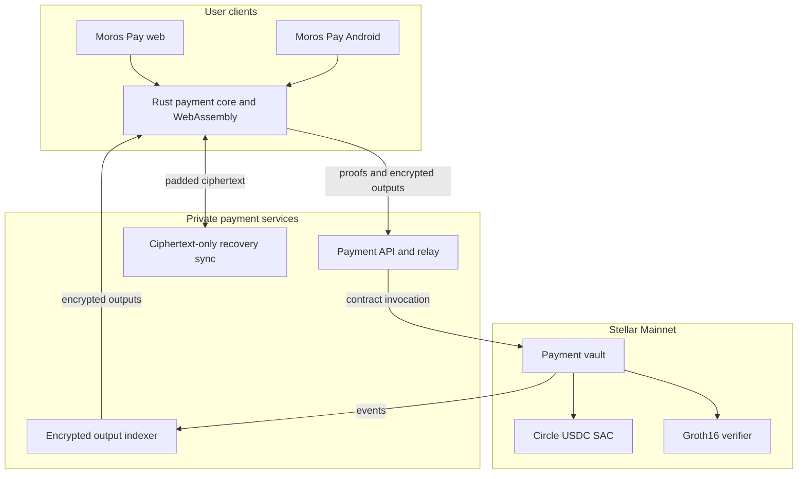
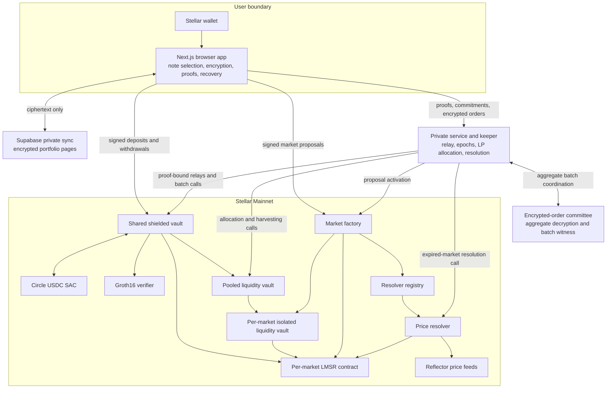

<p align="center">
  
</p>

<h1 align="center">Moros</h1>

<p align="center">
  <b>Private payment infrastructure for Circle USDC on Stellar.</b>
</p>

<p align="center">
  Pay, receive, request, recover, and build private financial applications with reusable shielded USDC.
</p>

<p align="center">
  <a href="https://pay.moros.fun">Moros Pay</a> |
  <a href="https://predict.moros.fun">Moros Predict</a> |
  <a href="https://predict.moros.fun/whitepaper.pdf">Whitepaper</a> |
  <a href="https://github.com/HoomanBuilds/moros">GitHub</a> |
  <a href="https://x.com/morosxyz">X</a>
</p>

> Moros is a private financial infrastructure suite on Stellar. Moros Pay moves Circle USDC through reusable private notes, signed payment requests, encrypted recovery, and proof-bound settlement. Moros Predict is Stellar's first private prediction market and the first live financial application built from the same privacy engineering.

## Products on Stellar Mainnet

| Product | Purpose | URL |
| --- | --- | --- |
| Moros Pay | Private Circle USDC payments, requests, recovery, and withdrawals | [pay.moros.fun](https://pay.moros.fun) |
| Moros Predict | Private USDC prediction markets with pooled liquidity | [predict.moros.fun](https://predict.moros.fun) |
| Moros private infrastructure | Payment notes, proof verification, relay, indexing, and encrypted sync | This repository |

Both applications use Circle USDC on Stellar Mainnet. XLM is used for Stellar fees and account reserve requirements, not as the payment or market asset.

## Contents

- [For judges and reviewers](#for-judges-and-reviewers)
- [Private payment infrastructure](#private-payment-infrastructure)
- [Moros Pay](#moros-pay)
- [How a private payment works](#how-a-private-payment-works)
- [Payment architecture](#payment-architecture)
- [Payment mainnet deployment](#payment-mainnet-deployment)
- [Moros Predict](#moros-predict)
- [Why private batch markets](#why-private-batch-markets)
- [How a market works](#how-a-market-works)
- [Prediction architecture](#prediction-architecture)
- [Pricing, liquidity, and fees](#pricing-liquidity-and-fees)
- [Privacy model](#privacy-model)
- [Supported mainnet markets](#supported-mainnet-markets)
- [Prediction mainnet deployment](#prediction-mainnet-deployment)
- [Application routes](#application-routes)
- [Repository structure](#repository-structure)
- [Technology stack](#technology-stack)
- [Run locally](#run-locally)
- [Switch between mainnet and testnet](#switch-between-mainnet-and-testnet)
- [Security and trust assumptions](#security-and-trust-assumptions)
- [Verification checklist](#verification-checklist)

## For judges and reviewers

### Quick access

| Item | Link or value |
| --- | --- |
| Private payments | [pay.moros.fun](https://pay.moros.fun) |
| Private prediction markets | [predict.moros.fun](https://predict.moros.fun) |
| Technical whitepaper | [predict.moros.fun/whitepaper.pdf](https://predict.moros.fun/whitepaper.pdf) |
| Source code | [github.com/HoomanBuilds/moros](https://github.com/HoomanBuilds/moros) |
| Network | Stellar Mainnet |
| Payment and market asset | Circle USDC |
| Payment deployment | [deployments/payments-mainnet.json](./deployments/payments-mainnet.json) |
| Payment proving manifest | [deployments/payments-mainnet-proving.json](./deployments/payments-mainnet-proving.json) |
| Prediction deployment | [deployments/private-mainnet.json](./deployments/private-mainnet.json) |
| Prediction proving manifest | [deployments/private-mainnet-proving.json](./deployments/private-mainnet-proving.json) |

### Private payment mainnet contracts

| Contract | Mainnet contract ID |
| --- | --- |
| Payment verifier | [CB4L4FGBRY2D53MYETJH45OVFWCXRBJEHTW7B4W56XROQ26VSHQPSPR5](https://stellar.expert/explorer/public/contract/CB4L4FGBRY2D53MYETJH45OVFWCXRBJEHTW7B4W56XROQ26VSHQPSPR5) |
| Payment vault | [CCKD5AHU2JGUR7RWMI5CT3UVOOCPDTQYK43DI24GKRKKUWZ3N22UOAIR](https://stellar.expert/explorer/public/contract/CCKD5AHU2JGUR7RWMI5CT3UVOOCPDTQYK43DI24GKRKKUWZ3N22UOAIR) |

### Private prediction mainnet contracts

| Contract | Mainnet contract ID |
| --- | --- |
| Groth16 verifier | [CD4RRUKDBQ6IP6LQJYTBGF5OOVFHIJWUULJCV52LANOLQEGYG4C5JQWL](https://stellar.expert/explorer/public/contract/CD4RRUKDBQ6IP6LQJYTBGF5OOVFHIJWUULJCV52LANOLQEGYG4C5JQWL) |
| Price resolver | [CAUDDAZVWDGWHDC6IHV66RAQ2CTLMXGXUEOT6VNU7OF4ACZPMXUEDLWA](https://stellar.expert/explorer/public/contract/CAUDDAZVWDGWHDC6IHV66RAQ2CTLMXGXUEOT6VNU7OF4ACZPMXUEDLWA) |
| Resolver registry | [CCK6GQ7DQDWCBZEIGVGDZ3AF3STHHXNVFYDKMFU634YHA7QDIQY3YKEB](https://stellar.expert/explorer/public/contract/CCK6GQ7DQDWCBZEIGVGDZ3AF3STHHXNVFYDKMFU634YHA7QDIQY3YKEB) |
| Shared shielded vault | [CBXZUAUEFAXZFRL4J7DTLS3GLAEY5OMIBBAUI672KJJE7FGU5LQJGXXL](https://stellar.expert/explorer/public/contract/CBXZUAUEFAXZFRL4J7DTLS3GLAEY5OMIBBAUI672KJJE7FGU5LQJGXXL) |
| Pooled liquidity vault | [CB45XJ65Y46J2KGLUI6ZGUQ6C5EN7KS2BGI636ISIKSSBHVDYICPWP3F](https://stellar.expert/explorer/public/contract/CB45XJ65Y46J2KGLUI6ZGUQ6C5EN7KS2BGI636ISIKSSBHVDYICPWP3F) |
| Market factory | [CDJ44IRLMZFEA4XY3J2XJMFLD4XIB3OIMRTYWBQZVX5ESBXMHNTOO3O7](https://stellar.expert/explorer/public/contract/CDJ44IRLMZFEA4XY3J2XJMFLD4XIB3OIMRTYWBQZVX5ESBXMHNTOO3O7) |

### Mainnet dependencies

| Dependency | Mainnet ID |
| --- | --- |
| Circle USDC issuer | [GA5ZSEJYB37JRC5AVCIA5MOP4RHTM335X2KGX3IHOJAPP5RE34K4KZVN](https://stellar.expert/explorer/public/account/GA5ZSEJYB37JRC5AVCIA5MOP4RHTM335X2KGX3IHOJAPP5RE34K4KZVN) |
| Circle USDC Stellar Asset Contract | [CCW67TSZV3SSS2HXMBQ5JFGCKJNXKZM7UQUWUZPUTHXSTZLEO7SJMI75](https://stellar.expert/explorer/public/contract/CCW67TSZV3SSS2HXMBQ5JFGCKJNXKZM7UQUWUZPUTHXSTZLEO7SJMI75) |
| Reflector CEX feed | [CAFJZQWSED6YAWZU3GWRTOCNPPCGBN32L7QV43XX5LZLFTK6JLN34DLN](https://stellar.expert/explorer/public/contract/CAFJZQWSED6YAWZU3GWRTOCNPPCGBN32L7QV43XX5LZLFTK6JLN34DLN) |
| Reflector fiat and metals feed | [CBKGPWGKSKZF52CFHMTRR23TBWTPMRDIYZ4O2P5VS65BMHYH4DXMCJZC](https://stellar.expert/explorer/public/contract/CBKGPWGKSKZF52CFHMTRR23TBWTPMRDIYZ4O2P5VS65BMHYH4DXMCJZC) |

### Recommended review path

1. Open [Moros Pay](https://pay.moros.fun) and inspect the private wallet, signed request, payment code, activity, and recovery flows.
2. Compare its network configuration with the [payment deployment manifest](./deployments/payments-mainnet.json) and [payment proving manifest](./deployments/payments-mainnet-proving.json).
3. Open [Moros Predict](https://predict.moros.fun/app) and inspect active and resolved markets.
4. Open a market to review its oracle route, liquidity, encrypted activity, batch pricing, and resolution state.
5. Open [Portfolio](https://predict.moros.fun/app/portfolio) to inspect private USDC, positions, claims, and refunds.
6. Open [Liquidity](https://predict.moros.fun/app/liquidity) to inspect pooled LP shares, automatic market allocation, and private exits.
7. Compare the market graph with the [prediction deployment manifest](./deployments/private-mainnet.json).

### What is technically distinct

- Moros Pay uses one reusable private USDC balance across transfers, requests, receipts, and withdrawals.
- A payment code identifies a private recipient without embedding a public Stellar account.
- Seven payment circuits support deposits, transfers with one, two, or four inputs, and withdrawals with one, two, or four inputs.
- Payment indexing discovers encrypted outputs while note ownership and private history are recovered locally.
- Encrypted sync stores padded ciphertext rather than a readable payment ledger.
- Moros Predict uses reusable shielded USDC for orders, liquidity, claims, refunds, and withdrawals.
- Individual side, quantity, note ownership, and private portfolio history are not published as plaintext.
- Encrypted orders clear in aggregate epochs, and the visible LMSR probability moves only after batch execution.
- Market creators propose supported markets without personally funding the full LMSR subsidy.
- Permissionless LP capital is pooled, while each funded market receives an isolated risk allocation.
- Fifteen Groth16 circuits bind private note transitions and batch execution to Stellar contract state.

## Private payment infrastructure

Moros provides the privacy layer needed to move Circle USDC without turning each internal payment into public account history. The infrastructure is separated into reusable components:

- A payment vault that holds Circle USDC and validates commitment and nullifier transitions.
- A Groth16 verifier that checks the registered payment circuit shapes through Stellar host cryptography.
- Seven Circom circuits for deposits, private transfers, change outputs, and public withdrawals.
- A Rust payment core shared by browser and mobile integrations.
- A browser WebAssembly package for private identities, notes, payment requests, receipts, and encrypted recovery.
- A payment API for proof relay, encrypted output discovery, attachments, action status, and sync authentication.
- A private indexer that follows vault events without becoming the source of truth for note ownership.
- Encrypted Supabase sync for cross-device recovery of private profiles and activity.
- Network-scoped manifests that bind clients to one Stellar network, vault, verifier, USDC contract, and artifact set.

The payment layer is designed so new Moros applications can reuse the same identity, note, recovery, and settlement primitives without duplicating privacy logic.

## Moros Pay

Moros Pay is the end-user payment application for the Moros private infrastructure. It is available as a web application, with an Android client in this repository.

Users can:

- Create or restore a private Moros identity from recovery words.
- Connect an existing Stellar wallet for Circle USDC funding.
- Add USDC to a reusable private balance.
- Receive through a rotatable payment code that contains no public Stellar account.
- Create fixed or open-amount signed payment requests with expiry.
- Verify payment codes and signed requests locally before approving a payment.
- Send private USDC and receive reusable private change.
- Save encrypted contacts and recent recipients.
- Recover private balance and profile data across devices from ciphertext-only sync.
- Export a scoped incoming-payment viewing capability without exporting spend authority.
- Withdraw private USDC to a valid Stellar account.

The web product lives at [pay.moros.fun](https://pay.moros.fun). Payment links use `https://pay.moros.fun/pay#...`, keeping the signed request payload in the URL fragment so it is not sent to the web server as part of the request path.

## How a private payment works

### 1. Create or restore a private identity

The client derives network-scoped spending, viewing, encryption, request-signing, and recovery material locally. A Moros payment code carries the private recipient information needed to create an encrypted output. It does not expose a Stellar account address.

### 2. Add Circle USDC

The user connects an existing Stellar wallet and authorizes a deposit into the Moros payment vault. The client creates encrypted outputs for the private identity and binds them to a zero-knowledge deposit proof.

### 3. Verify the destination

The sender pastes a payment code, opens a signed request, or scans its QR code on Android. The client checks the checksum, network, vault, asset, request signature, amount policy, and expiry before proof generation.

### 4. Prove and relay

The client selects one, two, or four private input notes, creates the recipient output and private change outputs, and generates the matching Groth16 proof. The relay submits the proof-bound contract invocation without receiving the private witness.

### 5. Recover and reuse

The recipient discovers encrypted vault outputs, decrypts matching notes locally, and can reuse the received USDC for another payment. Encrypted profile sync keeps recovery durable without giving the database readable balances, contacts, or payment history.

### 6. Withdraw when needed

The owner proves control of private input notes and directs Circle USDC to a valid Stellar account. Nullifiers prevent the same note from being spent twice.

## Payment architecture



### Payment proof set

| Circuit | Private inputs | Outputs | Purpose |
| --- | ---: | ---: | --- |
| `deposit` | 0 | 2 | Convert public Circle USDC into private notes |
| `transfer_one` | 1 | 4 | Spend one private note into recipient and change outputs |
| `transfer_two` | 2 | 4 | Combine two private notes for a transfer |
| `transfer_four` | 4 | 4 | Combine up to four private notes for a transfer |
| `withdraw_one` | 1 | 4 | Withdraw from one private note |
| `withdraw_two` | 2 | 4 | Withdraw from two private notes |
| `withdraw_four` | 4 | 4 | Withdraw from up to four private notes |

Every payment circuit exposes the same fixed 20-field public statement shape. The statement binds the action, context digest, membership root, nullifiers, output commitments, encrypted output hashes, attachment hash, and signed public amount.

## Payment mainnet deployment

The canonical records are [deployments/payments-mainnet.json](./deployments/payments-mainnet.json) and [deployments/payments-mainnet-proving.json](./deployments/payments-mainnet-proving.json).

| Component | Mainnet value |
| --- | --- |
| Network | `stellar:pubnet` |
| Payment vault | `CCKD5AHU2JGUR7RWMI5CT3UVOOCPDTQYK43DI24GKRKKUWZ3N22UOAIR` |
| Payment verifier | `CB4L4FGBRY2D53MYETJH45OVFWCXRBJEHTW7B4W56XROQ26VSHQPSPR5` |
| Circle USDC SAC | `CCW67TSZV3SSS2HXMBQ5JFGCKJNXKZM7UQUWUZPUTHXSTZLEO7SJMI75` |
| Merkle tree levels | 20 |
| Accepted root history | 64 roots |
| Payment circuits | 7 |
| Proof system | Groth16 on BN254 |

Clients validate the complete deployment object before deriving identities, scanning outputs, or preparing a proof. Invalid network, passphrase, contract, USDC, artifact, or circuit configuration fails closed.

## Moros Predict

Moros Predict is an end-user prediction market application and an on-chain market protocol.

Users can:

- Shield Circle USDC once and reuse the private balance across markets.
- Propose price markets without personally supplying the market's full LMSR subsidy.
- Place encrypted YES or NO orders with quantities from 1 to 1,000.
- Provide liquidity to a shared LP vault instead of manually choosing every market.
- Track created markets, positions, LP shares, claims, and refunds through encrypted private sync.
- Discuss markets through wallet-authenticated comments with optional images.
- Claim winning positions or recover refundable capital with a zero-knowledge proof.
- Withdraw private USDC back to a public Stellar wallet.

The public chain records solvency-critical state and aggregate market outcomes. Individual position ownership, side, quantity, and internal note history are not published as plaintext.

XLM is used only for Stellar transaction fees and account reserve requirements. It is not Moros market collateral.

## Why private batch markets

Normal on-chain prediction markets expose the trader, side, size, timing, and price impact before or during execution. That makes copying, front-running, whale tracking, and strategy reconstruction easy.

Moros separates order privacy from market solvency:

- The browser encrypts the order side and quantity.
- The shared vault consumes private USDC notes rather than taking a public payment for every bet.
- Orders collect into short epochs and execute atomically at one clearing price per side.
- The chain verifies commitments, nullifiers, state transitions, aggregate quantities, and proofs.
- The visible market price moves only after a batch is executed.
- Winning claims and refunds are bound to private notes and cannot be replayed.

The result is not complete anonymity. Stellar deposits and withdrawals remain public boundaries, and the current committee deployment has an explicit trust limitation described below.

## How a market works

### 1. Add USDC to the reusable private wallet

The user authorizes one Circle USDC transfer into the shared shielded vault. The deposit wallet and amount are public on Stellar. The resulting note is recovered by the user as private balance.

That balance can be split and reused for:

- Market orders
- LP deposits
- LP exits
- Claims
- Refunds
- Private note consolidation

### 2. Propose a market

Any connected user can define:

- Supported price asset
- USD strike price
- Exact future settlement time
- Liquidity target

The application applies the current protocol execution fee. The market factory validates the proposal against the resolver registry, allowed collateral, timing rules, liquidity tiers, and fee limits.

The proposer does not need to fund the LMSR subsidy personally. A proposed market activates only after the pooled LP vault assigns enough capital to cover its configured risk.

### 3. Allocate pooled liquidity

USDC deposited into the permissionless LP vault becomes shares in a common liquidity pool. The allocation service submits transactions that route eligible idle capital into pending markets.

Each market receives an isolated allocation and its own liquidity vault. A loss in one market cannot directly spend another market's reserved capital.

The pool keeps an idle reserve and enforces deployment, market, group, and withdrawal limits. LP share value can increase or decrease as markets settle and fees vest.

### 4. Submit encrypted orders

The browser:

1. Selects private USDC notes.
2. Creates encrypted YES and NO order values.
3. Generates the required Groth16 proof.
4. Submits the commitment and proof through the private service.

The market accepts up to 8 encrypted orders in one epoch. An epoch seals when it is full or its 60-second collection window ends. One-sided activity is allowed.

Every unit on the same side receives the same batch clearing price. The LMSR state and visible YES or NO probability change only after the aggregate batch executes on-chain.

### 5. Resolve from a registered price feed

After the final batch window closes, the keeper invokes the registered resolver. The resolver reads the enabled Reflector contract on Stellar, verifies the USD quote and freshness rules, and resolves the market on-chain.

For the currently supported markets:

- YES wins when the settlement value is equal to or above the strike.
- NO wins when the settlement value is below the strike.
- A feed that cannot produce a valid result before the oracle timeout moves the market toward a void path.

Resolution sources are selected through the resolver registry. New resolver implementations and routes can be introduced without replacing the shared shielded vault.

### 6. Claim, refund, or return LP capital

Settlement does not automatically send money to every wallet. Stellar contracts execute only when a transaction invokes them.

- A winner generates a claim proof and converts the position into private USDC.
- A losing position has no winning claim.
- A void market permits proof-bound refunds.
- An order batch that misses its execution deadline becomes refundable.
- Terminal market capital and vested fees return to the pooled LP system through service-submitted transactions.
- A user may withdraw private balance to a public Stellar wallet at any time allowed by vault capacity and withdrawal rules.

## Prediction architecture

Moros separates user secrets, service coordination, public market state, and external data into explicit trust boundaries.



### Browser responsibilities

- Connect the Stellar wallet and request only the signatures required for the selected action.
- Derive the network-scoped private archive key.
- Select, split, and recover private notes.
- Encrypt order side and quantity before submission.
- Generate user proofs without sending private witnesses to Moros.
- Encrypt private portfolio pages before they reach Supabase.

### Contract responsibilities

| Component | Responsibility |
| --- | --- |
| Groth16 verifier | Verifies registered proof shapes using Stellar host cryptography |
| Shared shielded vault | Holds Circle USDC and validates private note transitions |
| Pooled liquidity vault | Issues private LP shares and controls aggregate capital deployment |
| Market factory | Validates proposals and deploys isolated market instances |
| LMSR market | Prices orders, executes batches, resolves outcomes, and accounts for claims |
| Market liquidity vault | Isolates the capital assigned to one market |
| Resolver registry | Maps supported asset routes to approved resolver contracts |
| Price resolver | Reads fresh Reflector observations and resolves eligible markets |

Per-market LMSR and isolated liquidity contracts are deployed by the factory after a proposal is accepted and funded. Their addresses are dynamic and indexed by the application.

### Service responsibilities

The service layer coordinates work that is not automatic on-chain, but it does not replace contract proof checks or authorization:

- Accept and coordinate encrypted orders
- Seal full or expired epochs
- Produce aggregate batch proofs
- Submit batch execution
- Allocate idle LP capital
- Harvest terminal market capital
- Invoke resolution for expired price markets
- Maintain contract instance and code TTL
- Relay proof-bound user operations
- Serve public proving artifacts
- Proxy Stellar RPC with configured provider failover

## Pricing, liquidity, and fees

### LMSR pricing

Every market uses a logarithmic market scoring rule. Buying YES or NO changes the cost curve, so later batches receive a price based on already executed inventory.

The important execution rule is:

- Orders do not move the displayed probability while they are waiting in an epoch.
- A full or expired epoch executes its aggregate quantities atomically.
- The probability moves immediately after that execution.
- A single-sided epoch can execute. It does not require an opposite-side order.

This preserves batch fairness while preventing a completed position from leaving the price permanently frozen.

### Liquidity controls

The current factory and pooled vault configuration uses:

| Control | Mainnet value |
| --- | ---: |
| Supported market liquidity tiers | 20, 50, or 100 USDC |
| Pooled vault deposit cap | 100,000 USDC |
| Maximum active allocations | 8 |
| Maximum capital deployed | 80% |
| Minimum idle reserve | 20% |
| Maximum allocation to one market | 80% |
| Maximum allocation to one risk group | 80% |
| Withdrawal accounting window | 1 hour |
| Maximum immediate withdrawal per window | 10% |

An LP withdrawal can be partially limited when capital is allocated to active markets or the current withdrawal window is exhausted. Shares remain owned by the user and can be retried when capacity returns.

LP returns are not guaranteed. Share value reflects returned market capital, market profit or loss, and the LP portion of vested execution fees.

### Execution fees

The default market proposal uses a 2% fee rate. The factory rejects rates above the 10% protocol maximum.

The per-unit fee follows the market probability:

```text
fee_per_unit = lot_size * fee_rate * probability * (1 - probability)
```

The final amount uses contract-safe fixed-point rounding.

After exact rounding obligations are reimbursed:

- 80% of distributable execution fees accrue to LPs.
- 20% accrues to the protocol treasury.
- Refunded or voided orders do not create execution-fee revenue.

## Privacy model

Moros uses commitment and nullifier notes, browser-side encryption, Groth16 proofs, a shared shielded vault, and encrypted application sync.

Moros Pay and Moros Predict use separate mainnet vaults and proof manifests. This keeps payment state independent from market state while allowing both products to reuse the same privacy principles, client cryptography, encrypted recovery model, and Circle USDC settlement layer.

### What is public

- The Stellar account authorizing a deposit or withdrawal
- The deposit or withdrawal amount at the public boundary
- Deployed contract addresses and contract code
- Market definitions, strike, expiry, resolver route, and liquidity target
- Aggregate pool and market accounting
- Commitment roots and spent nullifiers
- Aggregate batch execution totals and resulting market price
- Resolution and terminal market state
- Wallet-authenticated comments and their uploaded images

### What is not published as plaintext

- Private note ownership
- Reusable private USDC balance
- Individual order side
- Individual order quantity
- The link between a user's separate positions
- Individual LP share ownership and private exit notes
- Individual claim or refund note history
- Private portfolio records stored in Supabase

Aggregate pool-to-market capital allocations remain public because the contracts must prove market solvency. The system hides which private LP note economically owns a share of that aggregate allocation.

### Encrypted private sync

Browser storage alone is not durable, so Moros backs up recoverable private state in Supabase without uploading plaintext portfolio data.

- A wallet signature derives a network-scoped archive key.
- The browser encrypts fixed-size pages with AES-256-GCM.
- Supabase stores ciphertext, version metadata, and opaque lookup material.
- The Supabase service role remains server-only.
- Switching network or shared vault changes the archive scope.

Supabase operators can observe storage access metadata, but they should not be able to read note ownership, order contents, or portfolio records from the stored ciphertext.

Market comments and images are intentionally public social records and are stored separately from encrypted private activity. Users should not publish private information in a comment.

### Zero-knowledge circuits

Moros Pay uses seven circuits for payment deposits, one, two, or four-input transfers, and one, two, or four-input withdrawals. Their canonical artifact record is [deployments/payments-mainnet-proving.json](./deployments/payments-mainnet-proving.json).

The mainnet proving manifest covers 15 Groth16 circuits:

| User and note flows | Market and service flows |
| --- | --- |
| deposit | execution_change |
| transfer | treasury |
| withdraw | exit_request |
| order | exit_cancel |
| claim | exit_match |
| refund | batch |
| liquidity_fund |  |
| liquidity_exit |  |
| liquidity_redeem |  |

The circuits use BN254 Groth16 proofs. Browser proving artifacts and verification keys are intentionally public. A proving key is not a secret and publishing it does not let someone forge a valid witness.

The canonical artifact record is [deployments/private-mainnet-proving.json](./deployments/private-mainnet-proving.json).

## Supported mainnet markets

Moros currently enables 40 price routes through two Reflector contracts from one oracle provider family.

### Crypto against USD

BTC, ETH, USDT, XRP, SOL, USDC, ADA, AVAX, DOT, MATIC, LINK, DAI, ATOM, XLM, UNI, and EURC.

### Foreign exchange against USD

EUR, GBP, CAD, BRL, JPY, CNY, MXN, KRW, TRY, ARS, PEN, VES, CLP, CRC, CDF, COP, HKD, INR, NGN, PHP, RUB, ZAR, and KES.

### Metals against USD

XAU.

The current production resolver uses Reflector's public mainnet feeds without a per-query oracle payment in the Moros integration. A Pyth Pro adapter path remains available to operators but is disabled and unconfigured in production.

Reflector CEX and Reflector fiat or metals are separate contracts, but they are not independent oracle providers. Provider diversity remains future work.

Sports, politics, weather, economics, entertainment, and custom event markets are not enabled on mainnet. Their UI options remain locked until Moros has production evidence observers, dispute windows, arbitration, and reliable void or refund monitoring for those categories.

## Prediction mainnet deployment

The canonical deployment record is [deployments/private-mainnet.json](./deployments/private-mainnet.json). Applications and services load addresses from the selected network manifest instead of duplicating contract IDs across source files. The reviewer-facing contract and dependency tables are in [For judges and reviewers](#for-judges-and-reviewers).

The mainnet deployment started from a clean state. Testnet markets, private notes, and application records were not migrated.

### Deployment provenance

| Field | Value |
| --- | --- |
| Deployment account | [GAEUBHV5QCM5GMTMR2EED2CL2KIHSZ37YAHIQATZXNZREMVCP6TVREUH](https://stellar.expert/explorer/public/account/GAEUBHV5QCM5GMTMR2EED2CL2KIHSZ37YAHIQATZXNZREMVCP6TVREUH) |
| Source commit | `b8108b94376f665000c361049021c9be5b0cf138` |
| Network passphrase hash | `7ac33997544e3175d266bd022439b22cdb16508c01163f26e5cb2a3e1045a979` |
| Verifier domain | `6d1cba0152f257e03168e2dc1dfe9e818b9662220cbf8e2cfb6973606ce0e041` |
| Accepted setup manifest SHA-256 | `f3e4d2120f23bee892d915f28400ab26cbae58bca62561a8b604b4aae838a623` |
| USDC decimals | 7 |

The deployment manifest contains no secret keys.

### Deployed WASM hashes

| Contract code | WASM hash |
| --- | --- |
| Groth16 verifier | `e2f43bb189dac32c44870f96f0f4534803a5e6efb713cde78a884e1fb1f8c739` |
| Price resolver | `fa2feaedc7622d45729e39e30a37946789934340a83bdd778981e7442194c06c` |
| Resolver registry | `8802df0b43b7ee2832de9a67da87eab68911f0a056f9608eaa5a81776bfaa686` |
| Shared shielded vault | `397a7769a0a70780c3f66b49f58ba0f7e270ebeccf57f9fa3d04ff18fb483e19` |
| Pooled liquidity vault | `d2065836ca2628d5ba4a5578b964f39380a20e77315f7d72a487da086ae6411d` |
| Market factory | `df0a4a4c029f55648980e3f921f4482799d7df570b997a491b47b16cd6c316e5` |
| LMSR market template | `567e85fd61a4be34bd1f5a1a5be43958c1649c662db0a6493de54ec389151346` |
| Isolated liquidity vault template | `742695db871af29ec35c2d85e76dfcfbd40180a705cfb815feb9c29975dc8b03` |

All listed core contract instances, Circle USDC SAC, and Reflector dependencies were confirmed through read-only Stellar mainnet RPC queries on July 24, 2026.

## Application routes

### Moros Pay

| Route | Purpose |
| --- | --- |
| [Home](https://pay.moros.fun) | Understand the private payment rail |
| [Wallet](https://pay.moros.fun/app) | View private balance and payment actions |
| [Send](https://pay.moros.fun/app/send) | Verify a payment code or signed request and send private USDC |
| [Receive](https://pay.moros.fun/app/receive) | Share or rotate a private payment code |
| [Request](https://pay.moros.fun/app/request) | Create a signed fixed or open-amount request |
| [Contacts](https://pay.moros.fun/app/contacts) | Manage encrypted private contacts |
| [Activity](https://pay.moros.fun/app/activity) | Recover private transfers, requests, and receipts |
| [Deposit](https://pay.moros.fun/app/deposit) | Add Circle USDC to the private balance |
| [Withdraw](https://pay.moros.fun/app/withdraw) | Exit private USDC to a Stellar account |

### Moros Predict

| Route | Purpose |
| --- | --- |
| [App](https://predict.moros.fun/app) | Browse active and resolved markets |
| [Create](https://predict.moros.fun/app/create) | Propose a supported price market |
| [Portfolio](https://predict.moros.fun/app/portfolio) | Manage private USDC, positions, claims, refunds, and history |
| [Liquidity](https://predict.moros.fun/app/liquidity) | Deposit into the pooled LP vault and manage private shares |
| `/app/market/[id]` | View a market, place an encrypted order, and join its wallet-authenticated discussion |

## Repository structure

```text
moros/
├── apps/
│   ├── android/                      Moros Pay Android application
│   └── pay-web/                      Moros Pay web application
├── circuits/                         Prediction Circom sources and proving manifests
├── contracts/
│   ├── payment-circuits/             Private payment circuit entrypoints
│   ├── payment-types/                Shared payment contract structures
│   ├── payment-vault/                Circle USDC payment note state machine
│   ├── payment-verifier/             Payment Groth16 verification
│   ├── lmsr-market/                  Batch pricing, execution, settlement, and claims
│   ├── market-factory/               Proposal validation and market deployment
│   ├── market-liquidity-vault/       Per-market capital isolation
│   ├── pooled-liquidity-vault/       Shared LP shares and allocation controls
│   ├── privacy-types/                Shared private transition structures
│   ├── resolver/                     Price-feed settlement adapter
│   ├── resolver-registry/            Approved resolver routes
│   ├── shielded-collateral-vault/    Reusable private USDC notes
│   └── zk-verifier/                  Groth16 proof verification
├── crates/
│   ├── payments-core/                Shared Rust payment cryptography and protocol types
│   ├── payments-core-wasm/           Browser WebAssembly bindings
│   └── payments-mobile-native/       Native mobile payment bindings
├── deployments/                      Network-scoped deployment and artifact records
├── docs/                             Technical whitepaper source and PDF
├── fixtures/                         Reference protocol economics fixtures
├── packages/
│   ├── payments-client/              Payment API, relay, indexer, and sync client
│   └── payments-crypto-web/          Built browser cryptography package
├── services/
│   ├── payment-api.mjs               Payment relay, output, action, and sync API
│   ├── payment-indexer.mjs           Payment vault event indexer
│   ├── payment-relay.mjs             Proof-bound payment transaction relay
│   ├── payment-sync.mjs              Encrypted recovery service
│   ├── private-server.mjs            Private relay, coordinator, RPC proxy, and artifact host
│   ├── resolve-keeper.mjs            Resolution, LP allocation, harvesting, and TTL keeper
│   └── oracle-config.mjs             Supported feeds and resolver route policy
└── web/                              Moros Predict application and browser proof flows
```

The repository also contains an event resolver foundation. It is not part of the enabled mainnet product until non-price market operations are production-ready.

## Technology stack

| Layer | Technology |
| --- | --- |
| Contracts | Rust, Soroban SDK, Stellar Asset Contracts, SEP-41 token interface |
| Payment proofs | Seven Circom circuits, Groth16, BN254 Stellar host functions |
| Prediction proofs | Fifteen Circom circuits, Groth16, BN254 Stellar host functions |
| Shared payment core | Rust, WebAssembly, Baby Jubjub, Poseidon2, canonical CBOR |
| Payment web | Next.js, React, TypeScript, Stellar SDK, Freighter |
| Payment mobile | Expo, React Native, WalletConnect, Stellar wallet deep links |
| Prediction web | Next.js, React, TypeScript, Stellar SDK, Stellar Wallets Kit, Tailwind CSS |
| Private state | Commitment and nullifier notes, encrypted outputs, AES-256-GCM archive encryption |
| Services | Node.js, Stellar SDK, payment relay and indexer, Reflector, optional Pyth Lazer Pro adapter |
| Data | Stellar RPC, Horizon, Supabase Postgres, encrypted private-sync pages |
| Production | Vercel web applications, supervised services, network-scoped RPC failover |

## Run locally

### Requirements

- Node.js 22 or newer
- npm
- Rust toolchain
- `wasm32v1-none` Rust target
- Stellar CLI

### Moros Pay web

```bash
cd apps/pay-web
npm install
cp .env.example .env.local
npm test
npm run build
npm run dev
```

The payment web application starts at `http://localhost:3000` by default.

### Moros Pay Android

```bash
cd apps/android
npm install
cp .env.example .env
npm test
npm run typecheck
npm start
```

### Moros Predict web

```bash
cd web
npm install
cp .env.example .env.local
npm run test:unit
npm run build
npm run dev
```

The prediction web application starts at `http://localhost:3000` by default.

### Services

```bash
cd services
npm install
cp .env.example .env
npm test
npm run verify:oracles
```

Service operation also requires network-scoped signer keys, Supabase credentials, archive secrets, and the selected proving-artifact directory. Never expose service-role keys or Stellar secret keys through `NEXT_PUBLIC_*` variables.

### Contracts

```bash
cd contracts
rustup target add wasm32v1-none
cargo test --workspace
cargo clean
```

Release builds use size optimization, link-time optimization, and overflow checks. Stellar meters CPU instructions, memory, ledger reads, ledger writes, events, and transaction size, so contract efficiency is evaluated through Soroban simulation and resource limits rather than an EVM gas number.

## Switch between mainnet and testnet

Moros keeps mainnet and testnet configuration in separate profiles. A network switch changes the passphrase, RPC, Horizon endpoint, private service, deployment manifest, proving artifacts, archive scope, and contract graph together.

### Moros Pay

The web and Android applications receive one complete, validated payment deployment object. Do not mix individual mainnet and testnet fields.

```bash
NEXT_PUBLIC_PAYMENT_DEPLOYMENT="$(jq -c . ../../deployments/payments-mainnet.json)"
EXPO_PUBLIC_PAYMENT_DEPLOYMENT="$(jq -c . ../../deployments/payments-mainnet.json)"
```

Use [deployments/payments-mainnet.json](./deployments/payments-mainnet.json) for mainnet and [deployments/payments-testnet.json](./deployments/payments-testnet.json) for testnet. Restart the selected application after changing the deployment.

### Moros Predict frontend

Set the selected public network:

```bash
NEXT_PUBLIC_STELLAR_NETWORK=mainnet
```

Configure both profiles:

```bash
NEXT_PUBLIC_MAINNET_STELLAR_RPC_URL=https://mainnet.sorobanrpc.com
NEXT_PUBLIC_MAINNET_STELLAR_HORIZON_URL=https://horizon.stellar.org
NEXT_PUBLIC_MAINNET_PRIVATE_SERVICE_URL=https://your-mainnet-service.example
NEXT_PUBLIC_ORACLE_MODE=free

NEXT_PUBLIC_TESTNET_STELLAR_RPC_URL=https://soroban-testnet.stellar.org
NEXT_PUBLIC_TESTNET_STELLAR_HORIZON_URL=https://horizon-testnet.stellar.org
NEXT_PUBLIC_TESTNET_PRIVATE_SERVICE_URL=https://your-testnet-service.example
```

### Services

Select the service network:

```bash
MOROS_NETWORK=mainnet
```

Keep scoped configuration for both profiles:

```bash
MOROS_MAINNET_RPC_URL=https://your-mainnet-rpc.example
MOROS_MAINNET_RPC_FALLBACK_URL=https://mainnet.sorobanrpc.com
MOROS_MAINNET_HORIZON_URL=https://horizon.stellar.org
MOROS_MAINNET_DEPLOYMENT=deployments/private-mainnet.json
MOROS_MAINNET_ZK_PUBLIC_DIR=circuits/private-mainnet-build/public
ORACLE_MODE=free

MOROS_TESTNET_RPC_URL=https://soroban-testnet.stellar.org
MOROS_TESTNET_RPC_FALLBACK_URL=https://soroban-testnet.stellar.org
MOROS_TESTNET_HORIZON_URL=https://horizon-testnet.stellar.org
MOROS_TESTNET_DEPLOYMENT=deployments/private-testnet.json
MOROS_TESTNET_ZK_PUBLIC_DIR=circuits/private-build/public
```

Restart the web application and every service after changing the selected network.

The loaders fail closed when the selected network, passphrase, deployment readiness, collateral contract, or proving artifacts disagree. Do not copy mainnet addresses into the testnet profile or reuse private-note archives across networks.

## Security and trust assumptions

### Enforced protections

- Payment clients validate network, passphrase, vault, verifier, Circle USDC, circuit names, artifact URLs, and limits before use.
- Payment requests bind the recipient, asset, amount policy, network, vault, creation time, and expiry to a local signature.
- Payment proofs use fixed statement shapes and bind action context, nullifiers, commitments, encrypted output hashes, attachments, and public value movement.
- Payment relays accept only the configured vault and supported methods.
- Circle USDC is the only enabled collateral in the mainnet manifest.
- Factory validation restricts resolver routes, fees, timing, liquidity tiers, and market duration.
- Isolated market vaults limit cross-market capital exposure.
- Commitment roots and nullifiers prevent private note replay.
- Proofs bind deposits, transfers, orders, claims, refunds, exits, and batch transitions.
- Epoch state versions prevent execution against stale market state.
- Oracle freshness checks reject stale resolution values.
- Timed refund and void paths prevent an order or market from depending forever on a successful keeper call.
- Network-scoped manifests and archive keys prevent accidental testnet or mainnet state mixing.
- The keeper maintains contract TTL so persistent Soroban state does not silently expire.

### Current trust assumptions

- The encrypted-order committee currently runs in `single_vm` mode.
- That VM holds the combined committee secret and can recover individual encrypted order values.
- This is not distributed threshold privacy.
- Availability currently depends on one primary service deployment, although Stellar RPC requests use provider failover.
- Reflector CEX and fiat or metals feeds are one provider family.
- Price resolution has freshness and timeout controls, but no independent provider quorum.
- Supabase stores encrypted private-sync pages, but access metadata remains observable to the infrastructure provider.
- Deposits and withdrawals expose the public Stellar account and amount.
- Contract source and automated tests have been reviewed internally. No independent external security audit has been completed.
- The current trusted setup is recorded in the proving manifest, but it is not an independent multi-party ceremony.

Before substantially raising deposit caps, the intended hardening path is an independent contract and circuit audit, distributed committee custody, an independent trusted setup, oracle-provider diversity, and stronger administrative key separation.

## Verification checklist

A reviewer can verify the production graph without trusting this README:

1. Open [deployments/private-mainnet.json](./deployments/private-mainnet.json).
2. Compare every core contract ID with the Stellar Expert links above.
3. Confirm the Circle USDC SAC equals the collateral contract in the manifest.
4. Confirm the source commit and every deployed WASM hash.
5. Open [deployments/private-mainnet-proving.json](./deployments/private-mainnet-proving.json) and confirm its `setup_manifest_sha256` matches the deployment record.
6. Check that the app and private service report `mainnet` before signing any transaction.
7. Confirm the wallet transaction uses the Stellar public network passphrase and the expected contract ID.
8. Confirm a market's resolver route is enabled before funding or ordering.
9. Treat any contract, collateral, network, or artifact mismatch as a hard stop.

For deeper operational detail, see [services/README.md](./services/README.md), the [payment deployment](./deployments/payments-mainnet.json), and the [technical whitepaper](./docs/Moros-Technical-Whitepaper.pdf).

---

Moros combines private USDC payments, reusable notes, encrypted recovery, proof-bound settlement, and private financial applications in one Stellar infrastructure suite.
