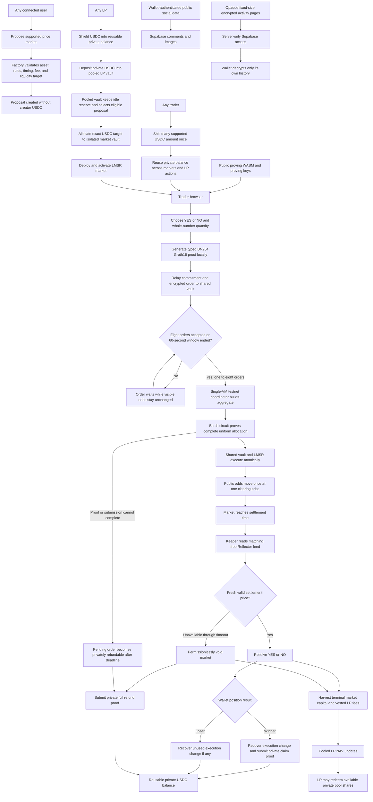

# Moros market flow

The current testnet coordinator holds the combined committee secret on one VM and can recover individual order values. This is not threshold privacy. Mainnet requires independently operated committee members and distributed key custody.

Proving WASM and proving keys are intentionally public. Private witnesses, note secrets, viewing keys, and plaintext activity are not public.

Settlement and payouts are pull-based. A keeper, relayer, or user submits each permissionless transaction. Resolving a market does not automatically transfer every user's funds.

Sports, politics, weather, economics, and other event markets are not part of this active flow. Their creation UI stays disabled until the complete evidence and dispute backend is operational.
