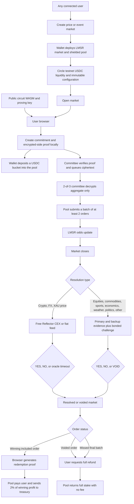

# Moros market flow

Circuit files in web/public/zk are intentionally public. The order secret, nullifier, proof witness, and position record stay in the user's browser.

Settlement and payouts are pull-based. A keeper, relayer, or user must submit each permissionless transaction. Resolving a market does not automatically transfer every user's funds.
